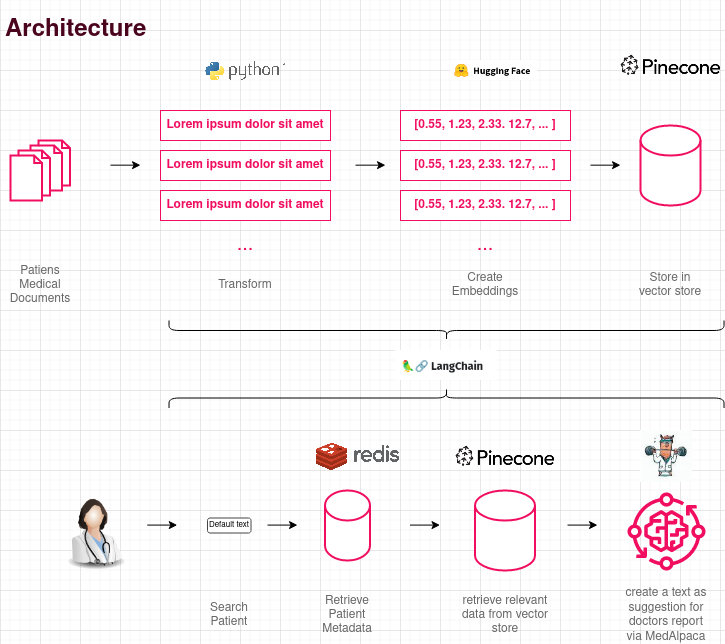

# AI Doc Report

This application is a PoC for automating the patient checkout process, especially the doctors report. We try to achieve this, by using the medical data of patients and summarizing it with Large Language Models.

# technicallities
our PoC relies on streamlit as ui but includes several other frameworks to a achieve a functional application.
in particullar we use 
- [Pinecone](https://www.pinecone.io/) to store vector encodings of relevant medical reports
- [Langchain](https://python.langchain.com/docs/get_started/introduction.html) to connect data storeage with the Large Language Model,
- and  [MedAlpaca](https://arxiv.org/abs/2304.08247) as alocally hosted AI (LLM) to create a Report. 

